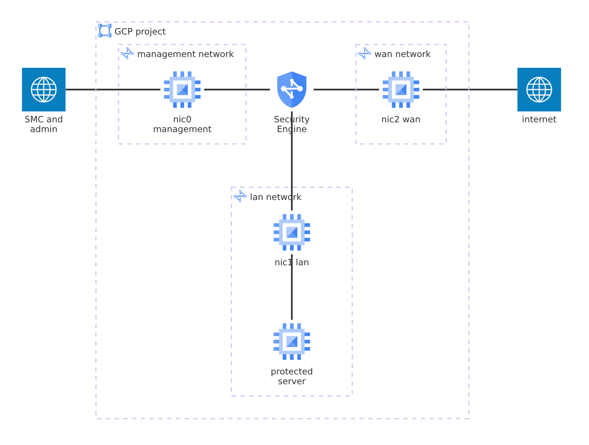

# Single engine, three interfaces

A complete, standalone deployment of one Forcepoint Network Security
Platform Security Engine on Google Cloud. It applies against an empty GCP
project: the example creates the networks, reserved addresses, firewall
rules and route the engine needs, the engine itself, and a protected test
server to verify the forwarding end to end.

The engine is the [`gcp-engine`](../../) module; the rest of this directory
is the infrastructure around it. Engine configuration (interfaces, policy,
VPN) lives in the Security Management Center (SMC) and is out of scope:
this example deploys the infrastructure and hands the engine its initial
contact data.



| NIC    | Role       | Public IP | Purpose                                  |
|--------|------------|-----------|------------------------------------------|
| `nic0` | management | yes       | metadata, SMC management channel, SSH    |
| `nic1` | lan        | no        | default gateway for the protected subnet |
| `nic2` | wan        | yes       | internet-facing traffic, VPN endpoint    |

## Contents

- [Usage](#usage)
- [Requirements](#requirements)
- [Inputs](#inputs)
- [Outputs](#outputs)
- [Resources](#resources)
- [Routing](#routing)
- [Verifying](#verifying)

## Usage

```bash
terraform init

cp terraform.tfvars.example terraform.tfvars
$EDITOR terraform.tfvars       # project_id, image, allowed CIDRs
terraform apply
```

## Requirements

| Requirement                 | Detail                                           |
|-----------------------------|--------------------------------------------------|
| Terraform                   | >= 1.5                                           |
| `hashicorp/google` provider | >= 6.0, < 9.0, pulled in by the module           |
| Google cloud credentials    | For example through gcloud login                 |
| Engine image                | Imported into the project, outside of Terraform  |
| SMC                         | Reachable from `nic0`, for an SMC-managed engine |

The engine image is imported first; the gcloud command is in the
[`boot_disk`](../../README.md#boot_disk) input in the module README.

## Inputs

| Name                                  | Description                                                                                                     | Type           | Default                    | Required |
|---------------------------------------|-----------------------------------------------------------------------------------------------------------------|----------------|----------------------------|----------|
| [`allowed_cidrs`](#allowed_cidrs)     | Sources permitted to reach the management and WAN interfaces: the SMC, your administrative networks, VPN peers. | `list(string)` | n/a                        | **yes**  |
| [`image`](#image)                     | Self-link or name of the engine image.                                                                          | `string`       | n/a                        | **yes**  |
| [`initial_contact`](#initial_contact) | Initial contact data for the engine. Sensitive. `null` boots an unconfigured engine.                            | `string`       | `null`                     | no       |
| `lan_cidr`                            | CIDR of the LAN subnetwork (`nic1`), where protected workloads live.                                            | `string`       | `"10.0.1.0/24"`            | no       |
| `machine_type`                        | Machine type for the engine. GCP requires at least one vCPU per interface.                                      | `string`       | `"n2-standard-4"`          | no       |
| `management_cidr`                     | CIDR of the management subnetwork (`nic0`).                                                                     | `string`       | `"10.0.0.0/24"`            | no       |
| `name`                                | Name of the engine instance, and prefix for every other resource.                                               | `string`       | `"engine"`                 | no       |
| `network_tag`                         | Network tag on the engine. Targeted by the VPC firewall rules.                                                  | `string`       | `"engine"`                 | no       |
| `project_id`                          | Project to deploy into.                                                                                         | `string`       | n/a                        | **yes**  |
| `protected_network_tag`               | Tag selecting which LAN instances route through the engine. The engine must not carry it.                       | `string`       | `"protected"`              | no       |
| `server_image`                        | Boot image for the protected test server. Any Linux image will do.                                              | `string`       | `"debian-cloud/debian-12"` | no       |
| `server_machine_type`                 | Machine type for the protected test server.                                                                     | `string`       | `"e2-small"`               | no       |
| `server_user`                         | Login the `ssh_public_keys` are installed for on the test server.                                               | `string`       | `"admin"`                  | no       |
| `ssh_public_keys`                     | Public keys in OpenSSH format, installed for `gencloud` on the engine and for `server_user` on the test server. | `list(string)` | `[]`                       | no       |
| `wan_cidr`                            | CIDR of the WAN subnetwork (`nic2`).                                                                            | `string`       | `"10.0.100.0/24"`          | no       |
| `zone`                                | Zone to deploy into. The three subnetworks are created in its region.                                           | `string`       | `"europe-north1-a"`        | no       |

### `initial_contact`

Optional. Initial contact data, passed straight to the module. The engine
reads it on first boot and contacts the SMC, which then shows the engine
as online. Leave it unset to boot an unconfigured engine, and configure it
later over the console with `sg-reconfigure`.

Produce it by creating the engine element in the SMC and saving its initial
configuration. The file carries a one-time password with limited validity, so
generate it close to the apply.

For cloud-initiated contact, where the engine creates its own SMC element over
the SMC API, pass a JSON document instead of an `engine.cfg`. See the
[`initial_contact`](../../README.md#initial_contact) input in the module README
for the format.

### `allowed_cidrs`

Required, with no default: an open management interface is not a sensible
default for an engine. The rules allow every protocol and port from these
ranges, so the list is the only thing between the management and WAN interfaces
and the rest of the internet. Keep it tight.

It must contain the SMC's address, the addresses you administer the engine
from, and any VPN peer the engine terminates.

### `image`

Self-link or name of the engine image, for example
`projects/my-project/global/images/engine-7-6-0`. The image is imported into the
project outside of Terraform and must carry the `MULTI_IP_SUBNET` guest OS
feature, or the engine forwards nothing. The import command is in the
[`boot_disk`](../../README.md#boot_disk) input in the module README.

## Outputs

| Name                   | Description                                                                      |
|------------------------|----------------------------------------------------------------------------------|
| `management_public_ip` | Public address of `nic0`: the SMC contact address, and the SSH target.           |
| `wan_public_ip`        | Public address of `nic2`, the WAN interface, for example the local VPN endpoint. |
| `network_interfaces`   | Per-interface index, subnetwork, network and addresses, keyed by NIC name.       |
| `networks`             | Self-links of the three VPC networks, keyed by role.                             |
| `subnetworks`          | Self-links of the three subnetworks, keyed by role.                              |
| `server_internal_ip`   | Private address of the protected test server.                                    |
| `server_ssh_command`   | `gcloud compute ssh` command for the protected server, over IAP.                 |
| `ssh_command`          | `ssh` command for the engine's management interface.                             |

## Resources

| Resource                                                                                                                                 | Type     | Created when                    |
|------------------------------------------------------------------------------------------------------------------------------------------|----------|---------------------------------|
| [`google_compute_network.this`](https://registry.terraform.io/providers/hashicorp/google/latest/docs/resources/compute_network)          | resource | three, one per engine interface |
| [`google_compute_subnetwork.this`](https://registry.terraform.io/providers/hashicorp/google/latest/docs/resources/compute_subnetwork)    | resource | three, one per engine interface |
| [`google_compute_address.internal`](https://registry.terraform.io/providers/hashicorp/google/latest/docs/resources/compute_address)      | resource | three, one per engine interface |
| [`google_compute_address.external`](https://registry.terraform.io/providers/hashicorp/google/latest/docs/resources/compute_address)      | resource | two, management and WAN         |
| [`google_compute_firewall.management`](https://registry.terraform.io/providers/hashicorp/google/latest/docs/resources/compute_firewall)  | resource | always                          |
| [`google_compute_firewall.wan`](https://registry.terraform.io/providers/hashicorp/google/latest/docs/resources/compute_firewall)         | resource | always                          |
| [`google_compute_firewall.lan`](https://registry.terraform.io/providers/hashicorp/google/latest/docs/resources/compute_firewall)         | resource | always                          |
| [`google_compute_firewall.iap`](https://registry.terraform.io/providers/hashicorp/google/latest/docs/resources/compute_firewall)         | resource | always                          |
| [`google_compute_route.protected_default`](https://registry.terraform.io/providers/hashicorp/google/latest/docs/resources/compute_route) | resource | always                          |
| [`google_compute_instance.server`](https://registry.terraform.io/providers/hashicorp/google/latest/docs/resources/compute_instance)      | resource | always                          |

The engine itself is created by the [`gcp-engine`](../../) module; its
resources are listed in the [module README](../../README.md#resources).

## Routing

Routes are tag-scoped: instances carrying the `protected` tag send their egress
through the engine.

For a management path that survives an engine outage, add a more specific
route for your administrative CIDRs via `default-internet-gateway`.

## Verifying

```bash
terraform output management_public_ip   # contacted by the SMC
terraform output wan_public_ip          # traffic side, e.g. VPN endpoint
```

The engine appears as online in the SMC once initial contact completes.
If it does not, connect over SSH (or set `enable_serial_console = true`
in the module block) and read the boot log.

Example protected server has no public address. Reach it over IAP:

```bash
$(terraform output -raw server_ssh_command)
```

## Support

These modules are provided as-is and support is best effort based. For the
product itself, refer to your Forcepoint support agreement.

## License

Apache 2.0, see [LICENSE](../../../../LICENSE).
